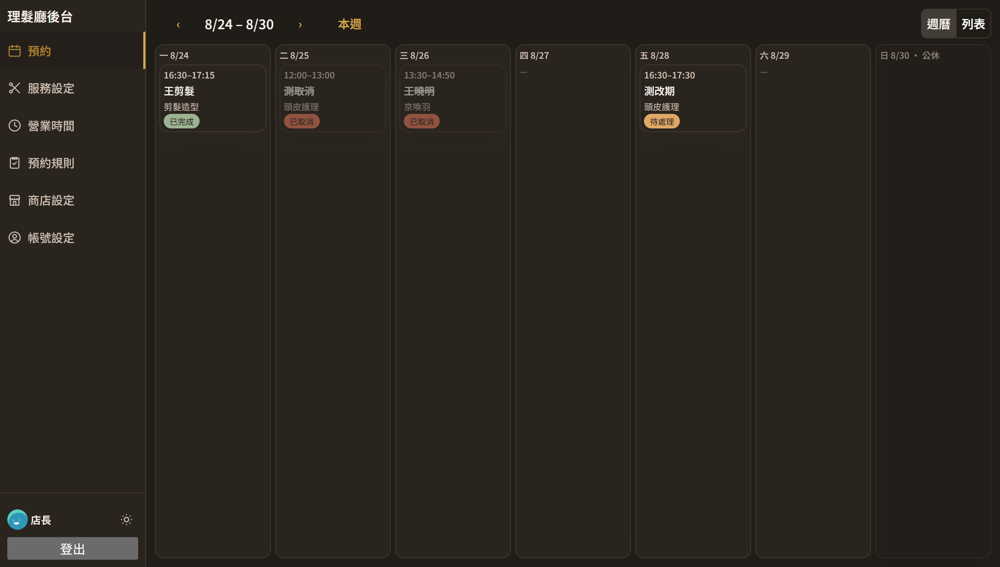
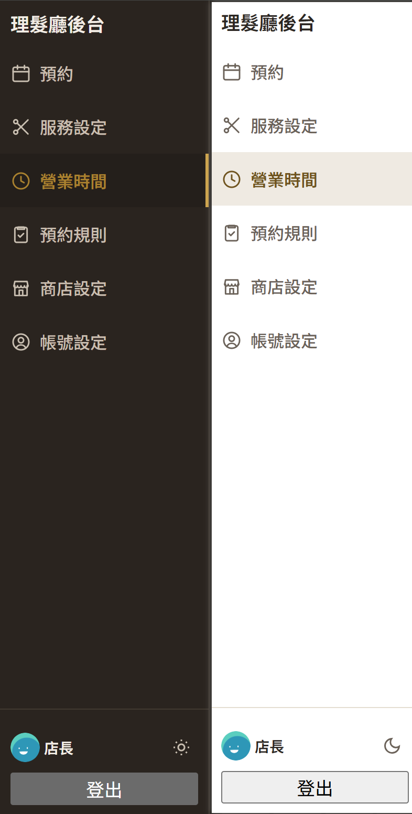

<div align="center">

  # 理髮廳線上預約系統

  從瀏覽服務、挑時段到自動寄出確認信與提醒信，顧客自助完成預約；設計師在後台一站管理預約、營業時間與店家資訊。

  [](LICENSE)
  [](https://nextjs.org)
  [](https://www.typescriptlang.org/)
  [](https://supabase.com)
  [](https://vercel.com)

  [線上體驗](https://pro5-nu.vercel.app) · [回報問題](https://github.com/<owner>/<repo>/issues)

</div>

---

<!-- TODO：repo 推上 GitHub 後，把上面「回報問題」連結與下面 clone 指令的 <owner>/<repo> 換成實際網址。 -->

## 這是什麼

**理髮廳線上預約系統**是一套給小型理髮廳使用的預約網站：顧客在前台瀏覽服務項目、依即時運算出的可預約時段下訂，不需要註冊帳號；設計師在後台管理每一筆預約（標記完成、取消、改期），並自行維護營業時間、公休日、服務項目、店家資訊與預約規則，不需要工程人員介入。

可預約時段的計算同時吃進每週固定營業時間、特殊公休日、服務間的緩衝時間與最短提前預約時間四個條件，且這些規則不只在畫面上生效——資料庫層的 RPC 本身也會擋下顧客繞過前端直接呼叫 API 的請求。預約成立、取消、改期與預約前 24 小時，系統會自動寄出對應的通知信。

## 線上體驗

**[pro5-nu.vercel.app](https://pro5-nu.vercel.app)**

## 畫面展示

<!-- TODO：截圖存到 docs/screenshots/ 對應檔名後會自動顯示，尺寸不拘、PNG／JPG 皆可。 -->

| 顧客前台：瀏覽服務與預約 | 設計師後台：預約管理 |
|---|---|
|  |  |

<p align="center">
  
</p>

## 功能特色

**顧客前台**

- 📅 **瀏覽與預約** — 挑選服務項目、依即時可預約時段下訂，填寫聯絡資訊後送出，成功頁顯示完整預約詳情。
- ⏰ **即時時段運算** — 同時反映當週固定營業時間、特殊公休日、服務間緩衝時間、最短提前預約時間與可預約
  視野上限；資料庫層另有防繞過機制，繞過前端直接呼叫 API 一樣會被擋下。
- 🔁 **防灌爆與去重** — 同電話號碼有效預約數上限，以電話／Email 自動辨識既有顧客、不重複建檔。
- 🏠 **品牌與政策顯示** — 首頁顯示店名、地址、電話、簡介與 Logo／封面圖，並顯示取消／改期時限等預約政策。
- 📧 **Email 自動通知** — 預約成立寄送確認信、取消／改期寄送通知信、預約前 24 小時自動寄送提醒信（Vercel Cron）。

**設計師後台**

- 🔐 **登入與帳號安全** — 帳密登入、忘記密碼自助重設、修改密碼／登入 Email／顯示名稱／大頭貼、雙重驗證
  （MFA／OTP）註冊與停用，關鍵操作強制已啟用 MFA 的帳號需達 aal2。
- 🗓️ **預約管理** — 週曆／列表檢視預約、標記完成、取消、改期，改期時段衝突由資料庫 exclusion constraint 把關。
- 🕐 **營業時間與時段管理** — 設定每週固定營業時間、標記特殊公休日（含受影響預約警告）、設定各服務項目
  的緩衝時間。
- ✂️ **服務項目管理** — 新增、編輯、下架／重新上架服務項目。
- 🏪 **商店基本資料設定** — 編輯店名／地址／電話／簡介、上傳／更換／移除 Logo 與封面圖。
- 📋 **預約規則與政策設定** — 設定最短提前預約時間、取消／改期時限，顧客前台同步顯示。

**介面與體驗**

- 🌗 **深色模式** — 全站可手動切換亮／暗色模式，選擇會記住在本機（不再只跟隨系統設定），切換入口在
  後台 Sidebar 底部個人資料區塊與顧客前台品牌列右側。
- 🧭 **Sidebar 導覽圖示化** — 後台導覽項目改為圖示＋文字並排，圖示與文字共用同一個顏色來源，隨明暗
  模式自動切換。

**平台與資料層**

- 🛡️ **安全邊界** — Supabase RLS 政策 + `SECURITY DEFINER` RPC（`get_available_slots`／`create_appointment`
  等）為顧客端唯一存取路徑，anon 對 `appointments`／`customers` 等核心表無任何直接讀寫權限。
- ✅ **驗證證據** — 每個 Epic 皆有對應的整合測試（見 `package.json` 的 `test:*` 指令）對真實 Supabase 專案
  驗證 RLS 邊界與業務邏輯，元件與流程單元測試以 `npm test` 執行。

## 未來規劃 🚧

尚未開始的 Epic：

- 👤 **顧客資料管理** — 設計師端檢視與管理顧客名單、預約歷史。
- 🔎 **顧客自助查詢／取消預約** — 顧客不需登入即可查詢自己的預約狀態，並自助取消。
- 📊 **儀表板與報表** — 營運數據總覽（預約量、服務項目熱門度、營收等）。
- 🧾 **稽核紀錄** — 記錄後台關鍵操作（誰在何時做了什麼變更），供事後追溯。

### 優化項目

以下是既有功能已知、規劃中但尚未實作的優化方向（詳見各任務卡的「後續任務」記錄）：

- 🔁 **`create_appointment` 感知緩衝時間與時段對齊** — 目前只有 `get_available_slots` 會套用
  `services.buffer_minutes` 與 30 分鐘時段對齊，`create_appointment` 尚未感知這兩項。
- 🕛 **後台改期表單的跨午夜邊界修正** — `lib/admin/business-hours.ts` 的受影響預約判斷在服務時段跨越
  午夜時有與 `create_appointment` 曾經修過的同一類邊界問題，待另立任務卡處理。
- 🔒 **`closed_dates` 補上 TRUNCATE 權限收斂** — 比照 `business_hours`／`booking_policy` 已有的縱深防禦。
- 🧩 **共用營業時間窗推導邏輯** — 評估把 `get_available_slots`／`create_appointment`／後台改期表單三份
  各自獨立的營業時間窗計算，收斂成一個共用函式。

## 技術棧

| 分類 | 技術 |
| --- | --- |
| 前端／後端 | Next.js 16（App Router + TypeScript，strict）、React 19、Server Components／Server Actions |
| UI | Material UI（MUI） |
| 資料庫 | Supabase Postgres，啟用 RLS，schema 見 `supabase/migrations/` |
| Email | [Resend](https://resend.com/)（確認信、通知信、提醒信） |
| 排程 | Vercel Cron（預約前 24 小時提醒信） |
| 測試 | Vitest、Testing Library（單元測試 + 對真實 Supabase 專案的整合測試） |
| 部署 | Vercel |

## 本機開發

### 前置需求

- Node.js 20+
- 一個 [Supabase](https://supabase.com/) 專案（套用 `supabase/migrations/` 內的 schema）
- 一組 [Resend](https://resend.com/) API 金鑰（若要測試 Email 通知功能）

### 安裝與啟動

```bash
git clone https://github.com/<owner>/<repo>.git
cd pro5
npm install
cp .env.example .env.local
```

編輯 `.env.local`，填入所需變數（完整清單見下方「環境變數」）：

```bash
NEXT_PUBLIC_SUPABASE_URL=你的-supabase-專案網址
NEXT_PUBLIC_SUPABASE_ANON_KEY=你的-supabase-匿名金鑰
SUPABASE_SERVICE_ROLE_KEY=你的-supabase-服務金鑰
EMAIL_API_KEY=你的-resend-金鑰
EMAIL_FROM_ADDRESS=noreply@你的已驗證網域
NEXT_PUBLIC_SITE_URL=http://localhost:3000
```

```bash
npm run dev
```

於 <http://localhost:3000> 啟動開發伺服器。完整變數清單見下方「環境變數」。

## 環境變數

`.env.local` 已加入 `.gitignore`；**真實金鑰只存放在 Vercel 專案的環境變數設定，絕不提交進版控**。

| 變數 | 用途 | 是否可暴露於前端 |
| --- | --- | --- |
| `NEXT_PUBLIC_SUPABASE_URL` | Supabase 專案網址 | 是 |
| `NEXT_PUBLIC_SUPABASE_ANON_KEY` | Supabase 匿名金鑰，受 RLS 規則限制 | 是 |
| `SUPABASE_SERVICE_ROLE_KEY` | Supabase 具完整權限的服務金鑰，僅限伺服器端程式碼使用 | **否，絕不可** |
| `EMAIL_API_KEY` | Resend 私密金鑰，用於寄送確認信／取消改期通知信／提醒信 | 否 |
| `EMAIL_FROM_ADDRESS` | 通知信寄件人地址，須為 Resend 已驗證網域下的地址 | 否 |
| `NEXT_PUBLIC_SITE_URL` | 對外基底網址，用於組出 email 中的預約連結 | 是 |
| `SUPABASE_WEBHOOK_SECRET` | 驗證 Supabase Database Webhook 呼叫通知信 API 路由的共用密鑰 | 否 |
| `CRON_SECRET` | 驗證 Vercel Cron 呼叫預約提醒信 API 路由的共用密鑰 | 否 |
| `DESIGNER_EMAIL`／`DESIGNER_PASSWORD` | 本機 seed script／整合測試用的設計師帳號，非 app 執行期讀取的變數 | 否 |

## 可用指令

| 指令 | 用途 |
| --- | --- |
| `npm install` | 安裝相依套件 |
| `npm run dev` | 啟動本機開發伺服器（<http://localhost:3000>） |
| `npm run build` | 建置正式環境版本 |
| `npm start` | 啟動已建置版本 |
| `npm run lint` | 執行 ESLint |
| `npx tsc --noEmit` | TypeScript 型別檢查 |
| `npm test` | 執行單元測試（Vitest） |
| `npm run test:booking` 等 | 對真實 Supabase 專案執行的整合測試，完整清單見 `package.json` 的 `test:*` |
| `npm run seed:booking` | 種入服務項目／營業時間最小可行資料（冪等） |
| `npm run kanban` | 啟動本機治理看板（<http://127.0.0.1:4420>） |

## 專案架構

```text
app/                顧客前台與設計師後台頁面（App Router）
  admin/               後台：預約管理、營業時間、服務項目、商店設定、帳號設定
  api/                 Webhook（預約事件通知信）與 Cron（預約提醒信）端點
  login/、reset-password/、auth/   登入、忘記密碼、Email 驗證回呼
components/         共用 UI 元件庫
lib/                資料存取封裝、業務邏輯（booking／admin／email 等，依領域分模組）
supabase/
  migrations/          版本化 schema migration（up/down 成對，人工貼 SQL Editor 套用）
tests/              對真實 Supabase 專案執行的整合測試 + 元件／流程單元測試
scripts/            一次性維運腳本（種子資料、建立設計師帳號）
ai/                 產品規格書、畫面規格、任務卡等治理文件
tools/kanban/       本機治理看板（視覺化 ai/ 底下的任務卡）
```

## 開發方法論

這個專案完整走過一套「AI 輔助、人工把關」的開發流程（見 [`AGENTS.md`](AGENTS.md) 與 `ai/process/workflow.md`）：每個功能先寫規格書、UI 變更先產出多個 mockup 變體交由人工選擇，再拆成範圍受限、附驗證契約的任務卡逐一實作；高風險或安全性相關的變更（例如修改顧客端唯一的預約寫入路徑）額外通過 architect／security-reviewer／test-engineer 三方審查關卡；每張任務卡完成後都附上測試指令、輸出與已知限制等驗證證據，最終才由人工核准。完整的規格書、任務卡與審查紀錄保留在 [`ai/artifacts/`](ai/artifacts/)，治理看板見 [`tools/kanban/README.md`](tools/kanban/README.md)。

## 授權

本專案採用 [MIT License](LICENSE)。
